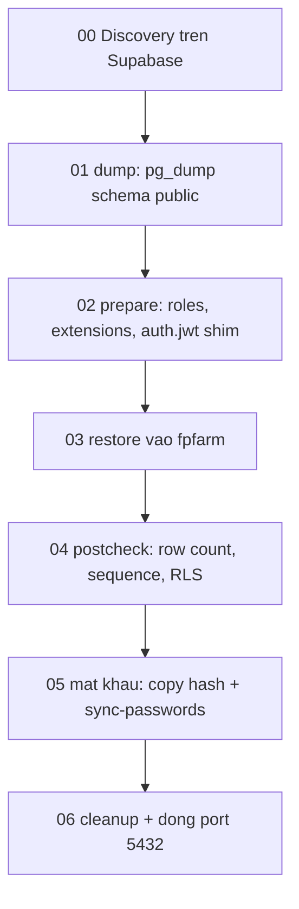

# Migrate database: Supabase → Postgres trên VPS

Chuyển toàn bộ schema `public` + dữ liệu từ Supabase sang Postgres `fpfarm` trên VPS (Dokploy), giữ nguyên RLS policy, grant cho `anon`/`authenticated`, các RPC và index `gin_trgm_ops`.

**Phạm vi**: chỉ dữ liệu. Phần dựng PostgREST + auth-service và sửa frontend nằm ở `docs/VPS_POSTGREST_PLAN.md` (thiết kế) và `docs/VPS_CUTOVER.md` (thao tác ngày chuyển đổi). App vẫn chạy trên Supabase trong suốt quá trình này.

⚠ `restore` nạp lại schema `public` từ Supabase, tức **xoá mất những gì `docs/vps-04-auth-schema.sql` đã tạo**. Mỗi lần chạy lại `restore` phải chạy lại `vps-04` — xem `docs/VPS_CUTOVER.md` mục 5.

## File trong bộ này

| File | Chạy ở đâu | Việc |
| --- | --- | --- |
| `docs/vps-00-discovery.sql` | Supabase (+ mục 1 trên VPS) | Thu thập version, schema extension, row count để đối chiếu |
| `docs/vps-01-prepare-target.sql` | VPS | Role, extension, schema `auth` + shim `auth.jwt()` — **trước** restore |
| `scripts/vps-dump-restore.sh` | Máy bạn | Chạy tất cả: `check`, `dump`, `prepare`, `restore`, `postcheck`, `sync-passwords`, `cleanup` |
| `docs/vps-02-postcheck.sql` | VPS | Đối chiếu số liệu, test RLS bằng JWT giả lập |
| `docs/supabase-migrate-auth-password-hash.sql` | Supabase | Copy hash bcrypt từ `auth.users` sang `mat_khau_hash` |
| `docs/vps-03-cleanup-after-restore.sql` | VPS | Bỏ dual-write sang `auth.users`, cấp quyền cho auth service |
| `docs/vps-04-auth-schema.sql` | VPS | Role `auth_service`, bảng phiên, RPC đăng nhập — xem `docs/VPS_CUTOVER.md` |

Không phải sửa tay file SQL nào: script truyền tham số vào `vps-01` qua biến psql — mật khẩu `authenticator` đọc từ `.env`, schema `pg_trgm` tự dò từ file dump.

## Cái bẫy quan trọng nhất: thứ tự

`public.is_admin_current_user()` là `LANGUAGE sql` và tham chiếu `auth.jwt()`:

```30:38:docs/supabase-fp_var_nhan_vien_mat_khau.sql
AS $$
  SELECT EXISTS (
    SELECT 1
    FROM public.fp_var_nhan_vien nv
    JOIN public.fp_var_chuc_vu cv ON cv.id = nv.chuc_vu_id
    WHERE LOWER(nv.email) = LOWER(auth.jwt() ->> 'email')
      AND cv.tt = 1
  );
$$;
```

Postgres validate thân hàm `LANGUAGE sql` ngay lúc `CREATE` (`check_function_bodies = on`), và biểu thức của RLS policy cũng bị parse lúc restore. Nếu database đích chưa có schema `auth` và hàm `auth.jwt()`, `pg_restore` chết với `schema "auth" does not exist`.

Nên: **chuẩn bị đích trước, restore sau.** Không phải ngược lại.



Dump chạy trước prepare vì `prepare` dò schema `pg_trgm` ngay trong file dump. Dump không tác động gì tới đích nên thứ tự này an toàn.

## Chuẩn bị

Cần `pg_dump`, `pg_restore`, `psql` phiên bản **>= server Supabase**:

```bash
brew install libpq && brew link --force libpq
pg_dump --version
```

Điền vào `.env` (xem mô tả từng biến trong `.env.example`):

- `SUPABASE_DB_URL` — Supabase Dashboard → Settings → Database → Connection string → URI. Dùng **Direct connection** hoặc **Session pooler**, cả hai port 5432. **Transaction pooler (6543) không dùng được cho `pg_dump`.** Mật khẩu ở đây là **database password**, khác `VITE_SUPABASE_ANON_KEY`.
- `VPS_DB_URL` — Postgres trên VPS qua IP public.
- `PGRST_AUTHENTICATOR_PASSWORD` — mật khẩu role `authenticator`, `openssl rand -base64 32`.

> **Mật khẩu phải percent-encode.** `Kem@2021` viết thành `Kem%402021`. Không encode thì libpq cắt chuỗi tại dấu `@` đầu tiên và hiểu host là `2021@163.61.73.151`. Script có kiểm tra và báo lỗi trường hợp này.

## Bước 0 — Discovery

Chạy `docs/vps-00-discovery.sql` trên Supabase SQL Editor, **lưu lại kết quả** (mục 3, 4, 5 dùng để đối chiếu ở bước 4). Chạy mục 1 trên VPS.

Hai thứ cần rút ra: `server_version_num` hai bên (đích phải >= nguồn) và row count từng bảng. Schema của `pg_trgm` thì không cần đọc bằng mắt — script tự dò từ file dump.

## Bước 1 — Dump

```bash
./scripts/vps-dump-restore.sh check     # kết nối hai đầu, phiên bản, đích đã prepare chưa
./scripts/vps-dump-restore.sh dump      # → backup/supabase-<timestamp>.dump
```

Các lựa chọn `pg_dump` và lý do:

- `--schema=public` — bỏ `auth`, `storage`, `realtime`, `vault` của Supabase.
- **Không** `--no-privileges` — mất hết `GRANT` cho `anon`/`authenticated` thì PostgREST `permission denied` ở mọi bảng.
- `--no-owner` — mọi object thuộc role kết nối tới VPS (`5fedu`). Hàm `SECURITY DEFINER` chạy dưới owner đó nên vẫn bypass RLS đúng như hiện tại.

`backup/` đã nằm trong `.gitignore` — file dump chứa toàn bộ dữ liệu thật, đừng commit.

## Bước 2 — Chuẩn bị database đích

```bash
./scripts/vps-dump-restore.sh prepare
```

Script tự dò schema `pg_trgm` trong file dump và truyền vào SQL cùng với `PGRST_AUTHENTICATOR_PASSWORD` từ `.env`. Không phải sửa file SQL.

`vps-01` có `DROP SCHEMA public CASCADE` — chỉ đúng khi `fpfarm` đang trống. Có guard chặn nếu database không tên `fpfarm`.

Nó tạo:

- `extensions` schema, `pgcrypto` (bắt buộc ở đây vì các RPC gọi `extensions.crypt`), `pg_trgm`.
- `search_path` cấp database `"$user", public, extensions` — giống Supabase. **Chỉ có hiệu lực ở kết nối mới**, nên đóng session psql rồi mở lại trước khi restore.
- Role `anon`, `authenticated`, `authenticator`.
- **Stub role** `postgres`, `service_role`, `supabase_admin`, … — dump giữ nguyên toàn bộ `GRANT` của Supabase, thiếu role thì câu `GRANT` tương ứng lỗi và `--single-transaction` rollback cả lần restore.
- Schema `auth` + `auth.jwt()`, `auth.uid()`, `auth.role()`. PostgREST đặt claim vào GUC `request.jwt.claims`, đúng cơ chế Supabase dùng, nên **RLS policy hiện tại chạy y nguyên, không cần sửa**.

## Bước 3 — Restore

```bash
./scripts/vps-dump-restore.sh restore
```

- `--single-transaction --exit-on-error` — lỗi giữa đường thì rollback sạch, không để lại DB nửa vời.
- Script lọc entry `SCHEMA - public` khỏi TOC, vì schema đó đã được bước 2 tạo sẵn (cần có trước để cài extension).
- Trước khi restore, script so schema `pg_trgm` trên đích với schema mà dump tham chiếu; lệch thì tự cài lại (lúc này chưa có index nào nên `DROP EXTENSION` an toàn).

Chạy cả năm bước một lần: `./scripts/vps-dump-restore.sh all`.

## Bước 4 — Postcheck

```bash
./scripts/vps-dump-restore.sh postcheck
```

Đối chiếu mục 1–4 với kết quả discovery. Lệch một dòng thì dừng, không đi tiếp.

Chú ý riêng **sequence** (mục 3 và 3b): sequence lệch thì insert mới đụng khoá chính. Mục 3b phải trả về **0 dòng**. Nếu có dòng, sửa từng cái:

```sql
SELECT setval(
  pg_get_serial_sequence('public.fp_mh_phieu_kho', 'id'),
  (SELECT max(id) FROM public.fp_mh_phieu_kho)
);
```

Mục 9 test RLS bằng JWT giả lập — **đổi `admin@company.vn` thành email admin thật** (nhân viên có `chuc_vu.tt = 1`), nếu không `la_admin` trả `false` là bình thường và không nói lên điều gì.

## Bước 5 — Mật khẩu

Hai việc, theo đúng thứ tự này.

**5a. Copy hash trên Supabase** — chạy trên Supabase, đọc `auth.users`:

```bash
psql "$SUPABASE_DB_URL" -v ON_ERROR_STOP=1 --single-transaction \
  -f docs/supabase-migrate-auth-password-hash.sql
```

Script copy `auth.users.encrypted_password` sang `fp_var_nhan_vien.mat_khau_hash` (cả hai đều là bcrypt nên nhân viên **giữ nguyên mật khẩu đang dùng**), rồi cấp mật khẩu mặc định `123456` + bật `phai_doi_mat_khau` cho ai không có tài khoản auth. Chạy lại nhiều lần được: chỉ ghi đè khi `auth.users.updated_at` mới hơn `mat_khau_cap_nhat_luc`.

**5b. Đồng bộ sang VPS** — chỉ 3 cột mật khẩu, không phải dump lại 153 MB:

```bash
./scripts/vps-dump-restore.sh sync-passwords
```

Hash không bao giờ được in ra terminal; file CSV trung gian bị xoá ngay sau khi dùng. Lệnh này đối chiếu bằng md5 digest của toàn bộ hash hai bên và báo lỗi nếu lệch.

> **Phải chạy lại cả 5a và 5b đúng lúc cut-over.** Trong khoảng thời gian từ giờ tới lúc cut-over, nhân viên nào đổi mật khẩu trên Supabase thì hash trên VPS thành lỗi thời.

## Bước 6 — Dọn dẹp

```bash
./scripts/vps-dump-restore.sh cleanup
```

Chỉ tác động lên bản VPS: bỏ block ghi song song `auth.users` trong `rpc_set_mat_khau`, drop `ensure_auth_user`, cấp `EXECUTE` `rpc_verify_mat_khau` cho `authenticator`. Bản Supabase không bị ảnh hưởng nên dual-write ở đó vẫn hoạt động cho tới lúc cut-over.

> **Phải chạy lại sau MỖI lần `restore`.** Restore mang nguyên bản `rpc_set_mat_khau` (còn block `auth.users`) và `ensure_auth_user` từ Supabase sang, ghi đè kết quả cleanup. Lệnh `all` **không** bao gồm `cleanup`.

Sau đó, ở tầng hạ tầng:

1. **Đóng port 5432 public** trên VPS, hoặc giới hạn firewall về IP của bạn. PostgREST và auth service dùng `VPS_DB_URL_INTERNAL` (hostname nội bộ trong project Dokploy) nên không cần port public.
2. **Đổi mật khẩu DB** — chuỗi kết nối cũ đã bị chia sẻ ngoài `.env`.

## Khắc phục sự cố

| Lỗi | Nguyên nhân | Cách xử lý |
| --- | --- | --- |
| `schema "auth" does not exist` | Chưa chạy bước 2 | `./scripts/vps-dump-restore.sh prepare` rồi restore lại |
| `role "supabase_admin" does not exist` | Thiếu stub role | Thêm tên role đó vào danh sách ở mục 5 của `vps-01`, chạy `prepare` lại |
| `operator class "gin_trgm_ops" does not exist` | `pg_trgm` sai schema | Script tự xử lý; nếu vẫn gặp thì `DROP EXTENSION pg_trgm; CREATE EXTENSION pg_trgm WITH SCHEMA <schema đúng>;` rồi restore lại |
| `function extensions.crypt(...) does not exist` | `pgcrypto` không ở schema `extensions` | `DROP EXTENSION pgcrypto; CREATE EXTENSION pgcrypto WITH SCHEMA extensions;` |
| `aborting because of server version mismatch` | `pg_dump` cũ hơn server Supabase | `brew install libpq && brew link --force libpq` |
| Không kết nối được Supabase, timeout | Direct connection chỉ có IPv6 | Dùng **Session pooler** (port 5432), không dùng Transaction pooler 6543 |
| `could not translate host name "2021@..."` | Mật khẩu chưa percent-encode | `@` → `%40` trong `.env` |
| `permission denied for table ...` khi test bằng `authenticated` | Dump bị mất grant (chạy với `--no-privileges`) | Dump lại đúng như script làm |
| `schema "public" already exists` | Restore không qua script (thiếu bước lọc TOC) | Dùng `./scripts/vps-dump-restore.sh restore` |

Làm lại từ đầu (đích vẫn trống hoặc chấp nhận xoá sạch) — `prepare` xoá `public` rồi dựng lại:

```bash
./scripts/vps-dump-restore.sh prepare
./scripts/vps-dump-restore.sh restore backup/supabase-<timestamp>.dump
```

## Kết quả lần chạy thật (04/08/2026)

Đã dump và restore thành công, `pg_restore` không một cảnh báo nào.

| | Supabase | VPS `fpfarm` |
| --- | --- | --- |
| Phiên bản | PostgreSQL 17.6 | PostgreSQL 18.4 |
| Kết nối | Session pooler `aws-1-ap-southeast-1` (direct chỉ có IPv6) | `163.61.73.151:5432` |
| Bảng / tổng dòng | 64 / 61.806 | 64 / 61.806 |
| View / function / trigger | 12 / 112 / 60 | 12 / 112 / 60 |
| RLS policy / index | 234 / 245 | 234 / 245 |
| Sequence | 77 | 77, `last_value` khớp từng cái |
| Grant `anon` / `authenticated` | 529 / 529 | 529 / 529 |
| Extension | `pg_trgm`@public, `pgcrypto`@extensions, `uuid-ossp`@extensions | giống nguồn |

Kiểm tra chức năng trên bản VPS: RLS với JWT giả lập của một admin thật trả `is_admin_current_user() = true`, đọc dưới role `authenticated` ra đủ 42 nhân viên và 7.391 phiếu kho; `rpc_get_session_bootstrap` trả về cả `employee` và `phan_quyen`; `rpc_ton_kho_matrix` chạy được; `authenticated` **không** đọc được `mat_khau_hash` và `anon` **không** gọi được `rpc_verify_mat_khau`.

### Mật khẩu

Cả 42 nhân viên đều có email và đều có tài khoản `auth.users` tương ứng, không ai đăng nhập bằng Google, nên **không ai phải nhận mật khẩu mặc định** — tất cả giữ nguyên mật khẩu đang dùng. Copy được 42/42 hash, digest md5 hai bên trùng khớp, `phai_doi_mat_khau` bằng 0.

Phân bố cost của bcrypt: **33 hash `$2a$06$`** và 9 hash `$2a$10$`. Cost 6 là do `ensure_auth_user` gọi `gen_salt('bf')` mà pgcrypto mặc định cost 6. Không phải lỗi — cost nằm trong chính hash nên `crypt()` verify đúng cả hai (đã test). Nhưng cost 6 chỉ 64 vòng, yếu hơn hẳn cost 10 (1.024 vòng); những hash này sẽ tự nâng lên cost 10 khi user hoặc admin đặt lại mật khẩu qua `rpc_set_mat_khau`.

Đã test end-to-end đường đăng nhập tương lai trên VPS: `rpc_set_mat_khau` đặt mật khẩu tạm cho một nhân viên rồi `rpc_verify_mat_khau` trả `ok = true` với mật khẩu đúng, `false` với mật khẩu sai và với email không tồn tại (không tiết lộ email nào có trong hệ thống), `phai_doi_mat_khau` truyền đúng. Toàn bộ nằm trong transaction rồi `ROLLBACK`; digest hash trước và sau test giống nhau.

`cleanup` đã chạy: `rpc_set_mat_khau` trên VPS không còn ghi `auth.users`, `ensure_auth_user` đã bị drop, `authenticator` gọi được `rpc_verify_mat_khau` còn `anon` thì không.

Hai điều phát hiện lúc chạy thật, đã sửa vào script:

- Direct connection `db.<ref>.supabase.co` chỉ phân giải ra IPv6 → phải dùng Session pooler.
- Supabase còn bật `uuid-ossp` ở schema `extensions`. Bản dump hiện tại không dùng tới, nhưng `vps-01` vẫn cài cho khớp nguồn (bọc trong khối bắt lỗi để không chặn cả script nếu image Postgres thiếu package).

## Cần chạy lại đúng lúc cut-over

Bản VPS hiện là ảnh chụp tại thời điểm migrate. Trước khi cắt thật, chạy lại theo thứ tự:

```bash
./scripts/vps-dump-restore.sh all              # dump mới → prepare → restore → postcheck
psql "$SUPABASE_DB_URL" -v ON_ERROR_STOP=1 --single-transaction \
  -f docs/supabase-migrate-auth-password-hash.sql
./scripts/vps-dump-restore.sh sync-passwords
./scripts/vps-dump-restore.sh cleanup          # BẮT BUỘC vì restore ghi đè kết quả cleanup
```

## Chưa làm

- PostgREST, auth service, reverse proxy trên Dokploy.
- Sửa `lib/supabase.ts` và `lib/auth.ts` để trỏ sang PostgREST và auth service mới.
- Xoá `lib/ensure-auth-user.ts` và các chỗ gọi `ensureAuthUser()` (function tương ứng trong DB đã bị drop trên bản VPS).
- `public.revoke_session(uuid)` đọc `auth.sessions` nên là code chết trên VPS. Không file TS nào còn gọi nó (xem `docs/supabase-drop-sao-luu-thiet-bi-dang-nhap.sql`) — drop được luôn khi dọn.
