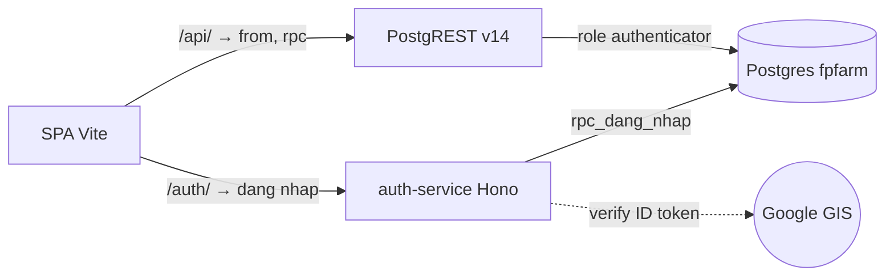

# Chuyển app sang PostgREST self-host (bỏ hẳn Supabase)

Tiếp nối `docs/VPS_MIGRATION.md` (đã xong phần dữ liệu). Phần này dựng **PostgREST + auth-service** trên Dokploy và sửa frontend để không còn gọi `supabase.co` nữa.

**Quyết định đã chốt**: JWT do một auth-service nhỏ ký (không ký trong Postgres, xem [Vì sao cần auth-service](#vì-sao-cần-auth-service)); giữ đăng nhập Google bằng luồng GIS popup; quên mật khẩu do admin cấp lại, không gửi email; có bảng phiên + refresh token để giữ đăng nhập lâu và khoá được tài khoản ngay; frontend deploy trên Dokploy cùng project.

## Khảo sát: app phụ thuộc Supabase ít hơn tưởng

| Thứ | Số lượng | Xử lý |
| --- | --- | --- |
| `supabase.from(...)` | 317 lời gọi / 48 file | **Không sửa gì** — đây chính là PostgREST |
| `supabase.rpc(...)` | 28 lời gọi | **Không sửa gì** |
| `supabase.auth.*` | 11 lời gọi, **3 file** | Viết lại: `lib/auth.ts`, `pages/ResetPassword.tsx`, `App.tsx` |
| `createClient` | **1 file** (`lib/supabase.ts`) | Điểm thay thế duy nhất |
| Storage / Realtime / Edge Function | **0** | Không phải làm gì |

Ảnh không nằm trên Supabase Storage: đều là Cloudinary, còn 17 dòng base64 nhúng trong DB (`fp_mh_danh_sach_hang_hoa` 12, `fp_ts_tai_san` 3, `fp_var_nhan_vien` 1, `fp_var_tt_cong_ty` 1) — nợ cũ, đã có `scripts/migrate-base64-to-cloudinary.mjs`, không liên quan đợt này.

RLS đã sẵn sàng để phơi ra HTTP: **64/64 bảng bật RLS**, **12/12 view dùng `security_invoker`** nên tôn trọng RLS của người gọi.

Quan trọng nhất: **không policy nào cần `auth.uid()`**, và `is_admin_current_user()` không được policy nào dùng (nó chỉ được `rpc_set_mat_khau` gọi để cho admin đặt mật khẩu người khác). Nên JWT chỉ cần hai claim `role` và `email` — **không phải dựng lại UUID của `auth.users`**, và 234 policy chạy y nguyên không sửa dòng SQL nào.

## Vì sao cần auth-service

Không thể để Postgres tự lo hết phần đăng nhập, vì Google trả về ID token ký **RS256**: xác minh cần khoá công khai RSA của Google, mà `pgcrypto` chỉ có HMAC và digest, **không verify được RSA**. Luồng authorization-code thì cần `client_secret` để đổi code — việc này không được làm trong trình duyệt. Bỏ qua xác minh và chỉ đọc claim `email` là lỗ hổng nghiêm trọng: ai cũng tự tạo được token ghi email giám đốc.

Đã cần một service thì cho nó ký luôn **mọi** token, kể cả token đăng nhập bằng mật khẩu. Ký JWT ở hai nơi (plpgsql và TypeScript) là nguồn lỗi vô ích.

Việc kiểm mật khẩu vẫn nằm trong DB (`rpc_verify_mat_khau` đã có và đã test). Service chỉ là lớp mỏng: gọi RPC, rồi ký token.

## Kiến trúc đích

Cả ba chạy sau **một domain duy nhất** (ví dụ `erp.5fedu.vn`), Traefik của Dokploy route theo path: `/` → SPA, `/api/*` → PostgREST, `/auth/*` → auth-service. Một domain nên **không có CORS**, không phải cấu hình `Access-Control-Allow-Origin`, và cookie/token không đi cross-site.

## Giai đoạn 1 — PostgREST trên Dokploy

Chưa đụng frontend, app vẫn chạy Supabase, không rủi ro.

Service mới trong project, image `postgrest/postgrest:v14.16` (bản mới nhất). Biến môi trường:

| Biến | Giá trị | Ghi chú |
| --- | --- | --- |
| `PGRST_DB_URI` | conn string role `authenticator`, host **nội bộ** | mật khẩu đã có trong `.env` |
| `PGRST_DB_SCHEMAS` | `public` | |
| `PGRST_DB_ANON_ROLE` | `anon` | |
| `PGRST_JWT_SECRET` | `PGRST_JWT_SECRET` trong `.env` | dùng chung với auth-service |
| `PGRST_DB_EXTRA_SEARCH_PATH` | `public, extensions` | `pgcrypto` nằm ở `extensions` |
| `PGRST_OPENAPI_MODE` | `disabled` | không phơi toàn bộ schema ra Internet |
| `PGRST_DB_POOL` | `10` | |

Không đặt `PGRST_DB_MAX_ROWS`: `fetchAllRows`/`fetchTablePage` trong `lib/supabase.ts` đang tự phân trang 1000 dòng và dựa vào `count: 'exact'`, đặt max-rows sẽ làm lệch `Content-Range`.

**Nghiệm thu** bằng script mới `scripts/postgrest-smoke.sh`: tự ký JWT bằng secret rồi kiểm từng nhóm cú pháp mà app thực sự dùng — `select` lồng quan hệ, `or`, `in`, `order`, `range` + `count=exact`, `upsert`, và cả 28 RPC. Không có token thì phải trả 401/rỗng. Nếu bản v14 lệch hành vi so với `@supabase/postgrest-js@2.98` (client sinh cú pháp theo PostgREST v12 mà Supabase đang chạy) thì hạ image về `v12.2` — smoke test là chỗ phát hiện việc đó, nên phải chạy trước khi sửa frontend.

## Giai đoạn 2 — SQL bổ sung (`docs/vps-04-auth-schema.sql`)

**Bảng phiên** `fp_var_phien_dang_nhap`: `id`, `nhan_vien_id`, `email`, `refresh_hash` (SHA-256 của refresh token, **không lưu token thô**), `het_han_luc`, `tao_luc`, `dung_lan_cuoi`, `thu_hoi_luc`, `user_agent`, `ip`. Bật RLS và **không tạo policy nào** cho `anon`/`authenticated` → không ai đọc được bảng này qua PostgREST.

**Các RPC `SECURITY DEFINER`**, chỉ cấp `EXECUTE` cho role của auth-service:

- `rpc_dang_nhap(email, mat_khau)` — gọi logic của `rpc_verify_mat_khau`, chặn `trang_thai = Nghỉ việc`, trả về `nhan_vien_id`, `ho_va_ten`, và **`phai_doi_mat_khau`**. Cờ này phải đi kèm response đăng nhập vì `authenticated` đã bị thu hồi quyền SELECT trên cột đó, frontend không tự đọc được.
- `rpc_tim_nhan_vien_theo_email(email)` — cho nhánh Google (không có mật khẩu).
- `rpc_tao_phien`, `rpc_lam_moi_phien` (rotation: thu hồi refresh cũ và cấp cái mới trong cùng transaction), `rpc_thu_hoi_phien`.

**Chống dò mật khẩu**: bảng `fp_var_lan_dang_nhap_sai` + kiểm trong `rpc_dang_nhap` — quá 10 lần sai trong 15 phút cho một email thì chặn tạm. Supabase trước đây lo phần này, giờ là việc của mình.

**Khoá tài khoản ngay**: trigger trên `fp_var_nhan_vien` khi `trang_thai` đổi sang Nghỉ việc → set `thu_hoi_luc` cho mọi phiên của email đó. Kết hợp access token 15 phút, người nghỉ việc mất quyền trong tối đa 15 phút.

**Đóng lỗ hổng `anon`**: xoá 2 policy `anon` trên `fp_hr_nhom_phieu_hanh_chinh` (`SELECT` và `ALL`). Trên Supabase chúng núp sau anon key, nhưng khi PostgREST ra Internet thì **ai không đăng nhập cũng đọc, sửa, xoá được bảng này**. Đã kiểm tra: bảng có sẵn 2 policy tương đương cho `authenticated`, xoá phần `anon` không làm hỏng module.

## Giai đoạn 3 — auth-service

Thư mục `services/auth/`: Node 22 + Hono + TypeScript, `pg` để gọi RPC, `google-auth-library` để verify ID token, `jose` để ký JWT. Khoảng 200 dòng, có Dockerfile riêng.

| Endpoint | Việc |
| --- | --- |
| `POST /auth/dang-nhap` | Public path (Traefik strip `/auth` → service nhận `/dang-nhap`). `{email, mat_khau}` → `rpc_dang_nhap` → cấp cặp token |
| `POST /auth/dang-nhap-google` | `{id_token}` → verify với `audience = GOOGLE_CLIENT_ID` và `email_verified` → `rpc_tim_nhan_vien_theo_email`. Không có hồ sơ nhân viên → 403 kèm mã lỗi để UI hiện `page.login.googleNoEmployee` như hiện tại |
| `POST /auth/lam-moi` | Rotation refresh token |
| `POST /auth/dang-xuat` | Thu hồi phiên |
| `GET /auth/khoe` | Health check cho Dokploy (service nhận `/khoe`) |

Access token 15 phút, claim `{role: 'authenticated', email, nv, iat, exp}`, HS256 bằng `PGRST_JWT_SECRET`. Refresh token 30 ngày, chuỗi random 32 byte, DB chỉ giữ SHA-256.

Không có endpoint đổi mật khẩu: frontend gọi thẳng `rpc_set_mat_khau` qua PostgREST với tư cách `authenticated`, RPC đó đã tự phân biệt tự đổi và admin đổi cho người khác.

Trên Google Cloud Console cần thêm domain mới vào **Authorized JavaScript origins** của OAuth client đang dùng cho Supabase. Luồng GIS chỉ cần Client ID, **không cần Client Secret**, và cũng không cần khai redirect URI.

## Giai đoạn 4 — Frontend

Tách làm hai commit để dễ review và dễ revert.

**Commit 1 — đổi tầng client, giữ nguyên tên biến.** `lib/supabase.ts` đổi `createClient` sang `PostgrestClient` của `@supabase/postgrest-js` (đúng thư viện nằm bên dưới `supabase-js`, đã có sẵn ở `node_modules` dạng transitive, sẽ khai thành dependency trực tiếp). Vẫn export tên `supabase` → **345 chỗ gọi không sửa một dòng**. Kèm theo:

- `lib/token-store.ts`: access token giữ trong memory, refresh token trong `localStorage`; `getAccessToken()` tự làm mới khi sắp hết hạn, dùng single-flight promise để nhiều query song song không gọi `/lam-moi` cùng lúc; gặp 401 thì làm mới một lần rồi thử lại.
- Custom `fetch` gắn `Authorization: Bearer`.
- Dev request logger đang nhận diện request theo đường dẫn `/rest/v1/` — đổi sang base URL mới, không thì mất công cụ theo dõi egress.
- `lib/auth.ts`: `signInWithPassword` → `/auth/dang-nhap`; `signInWithGoogle` → GIS popup rồi `/auth/dang-nhap-google`; `signOut` → `/auth/dang-xuat`; `getSessionEmployee` và `getSessionBootstrap` lấy email bằng cách decode access token thay vì `supabase.auth.getSession()`; bỏ `requestPasswordReset` và `updatePassword`.
- `pages/ResetPassword.tsx`: từ "đặt lại mật khẩu qua link email" thành "đổi mật khẩu cho người đang đăng nhập", dùng cho cả trường hợp `phai_doi_mat_khau` buộc đổi. Route `/dat-lai-mat-khau` giữ nguyên.
- `pages/Login.tsx`: thay nút Google sang GIS.
- `App.tsx` chỗ kiểm `supabase.auth.getSession()` để hiện toast `googleNoEmployee`.
- Xoá `lib/ensure-auth-user.ts` và 2 chỗ gọi trong `nhan-vien-service.ts` (function `ensure_auth_user` trong DB đã bị drop ở `vps-03`).
- Biến môi trường: bỏ `VITE_SUPABASE_URL` / `VITE_SUPABASE_ANON_KEY`, thêm `VITE_API_URL`, `VITE_AUTH_URL`, `VITE_GOOGLE_CLIENT_ID`. Cập nhật `.env.example`.
- Bỏ `supabase-js` khỏi bundle → phải chạy `npm run update:bundle-baseline` vì `scripts/check-bundle-size.mjs` so với baseline cũ.

**Commit 2 — rename thuần.** `lib/supabase.ts` → `lib/db.ts`, biến `supabase` → `db`, codemod trên 48 file. Tách riêng vì đây là 48 file thay đổi máy móc, trộn vào commit 1 sẽ che mất phần logic thật sự cần review.

## Giai đoạn 5 — Cut-over

1. Chạy lại `scripts/vps-dump-restore.sh all` rồi `sync-passwords` và `cleanup` để lấy dữ liệu mới nhất (quy trình đã chạy thành công một lần, xem `docs/VPS_MIGRATION.md`).
2. Build SPA với biến môi trường mới, deploy service static trên Dokploy, gắn domain + TLS.
3. Đăng nhập thử bằng mật khẩu và bằng Google, đi hết các module chính.
4. Giữ Supabase ở chế độ chỉ đọc vài ngày làm đường lùi.
5. Đóng port 5432 ra Internet trên VPS, đổi mật khẩu DB, xoá `SUPABASE_DB_URL` khỏi `.env`.

Đường lùi ở mỗi giai đoạn: giai đoạn 1–3 chưa đụng app đang chạy; giai đoạn 4 là `git revert` hai commit và build lại với biến Supabase cũ.

## Rủi ro đã biết

**234 policy đều là `TO authenticated USING (true)`.** RLS chỉ kiểm "đã đăng nhập hay chưa", không lọc theo người hay chi nhánh — ai có token hợp lệ là đọc ghi được mọi bảng. Phân quyền theo module hiện chỉ chặn ở giao diện, gọi API trực tiếp là đi qua được. Đây **không phải** hồi quy do migrate, Supabase đang y như vậy, nhưng khi tự phơi API thì cần biết rõ. Siết lại là việc riêng, ngoài phạm vi đợt này; access token 15 phút và trigger thu hồi phiên là phần bù trước mắt.

**Sai khác phiên bản PostgREST.** `@supabase/postgrest-js` sinh cú pháp theo bản PostgREST mà Supabase chạy (v12). Chạy v14 có thể lệch ở chi tiết như mã lỗi hoặc hành vi `Prefer`. Smoke test ở giai đoạn 1 là chốt kiểm; lệch thì hạ về `v12.2`.

**`localStorage` không đồng bộ giữa nhiều tab.** Supabase client trước đây tự lo. Token store cần lắng nghe event `storage` để đăng xuất ở tab này thì tab kia cũng thoát.

## Checklist nghiệm thu

- [ ] `scripts/postgrest-smoke.sh` xanh toàn bộ, kể cả 28 RPC
- [ ] Không token → mọi endpoint trả 401 hoặc rỗng; `fp_hr_nhom_phieu_hanh_chinh` không còn đọc được khi chưa đăng nhập
- [ ] Đăng nhập sai 11 lần liên tiếp bị chặn tạm
- [ ] Đặt một nhân viên sang Nghỉ việc → phiên bị thu hồi, refresh thất bại
- [ ] Đăng nhập Google với email có hồ sơ thì vào được, email không có hồ sơ thì hiện đúng thông báo
- [ ] Nhân viên có `phai_doi_mat_khau` bị buộc đổi ngay sau đăng nhập
- [ ] `npm run typecheck`, `npm test`, `npm run lint`, `npm run check:bundle` đều xanh
- [ ] Chrome DevTools: không còn request nào đi `supabase.co`
